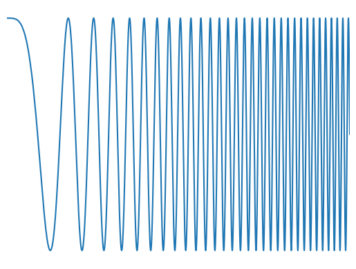

# {WIP} FMCW 
Explorations in FMCW Processing 

# What is FMCW?

Frequency Modulated Continuous Wave (FMCW) is a type of transmission system in which a "continuous" carrier is swept/chirped in frequency in a known manner(Though there is recent research in pseudo-random frequency sweeps!). This is typically used in ranging systems, and opens the door to doppler processing, which gives a true measure of a target's velocity. This is largely in contrast to pulsed transmission systems in which the system would send out an impulse signal at known times, and measure the time of propogotation. 

--- 

(skip this section to get to the fun stuff below!)

To begin with, let us set a scene. Let's imagine we're standing in a park and would like to measure the distance between us and a stationary bird. Naturally, we would estimate this with our (human) vision first. If we had bat-like organs, we would be transmitting sonar signals towards the location of the bird, and looking for the time it takes for a signal to return back to us. This is the common Time-of-Flight(TOF) method. Naturally, this method of detection gives you the time it takes for an electromagnetic signal to propogate to the target, and with knowledge of the speed of that signal, it is trivial to calculate the distacne of that detection. 

$$ d = \frac{ct}{2} $$

This is great, we can calculate the distance of some object, fairly easily. But what if we wanted to know how fast this object is moving? Well then we'd need to build a track of where this object is over _time_, and take the derivative of these positions. This is unsusprisingly, quite complex. In comes FMCW. 

In quick terms, FMCW changes this signal from a single pulse, to a sweep in frequency. The frequency content of the return signal* is then used to estimate the distance of the target detection AND the velocity, simultaenously. This is possible due to the doppler effect in which we observe a up/down shift in the frequency of a signal, ultimately determined by the velocity of this object.

*This isn't _exactly_ the return signal, and is really the _mixed_ return signal, but we will explore this further below. 

The first step in constructing a frequency sweep, is understanding how an electronic device can actually sweep the frequency of a signal. Remember that the derivative of the phase of a signal, gives you the instantaenous frequency of that signal. So in nominal FMCW processing, where we want a *linear* frequency sweep(commonly referred to as a _chirp_), we will change the phase in a quadratic manner. I will skip over the device physics in this overview, but to keep it short, one can use a PLL to accurately control the phase of a signal. If you're like me, you may have always thought that PLLs were designed to simply keep a *constant* phase, but they can also be used to precisly control the phase over time! If you'd like to learn more about how this is done for radar systems, see the `pll/` folder in this repo, where a similiar overview and simulation code is provided.(WIP)

So we can model a frequency sweep simply as a signal with a quadratic changing phase. A nominal FMCW system will define a standard "carrier" frequency, from which it will sweep a relatively narrow band of frequencies. This is referred to as the chirp. The rate at which this signal sweeps from the minimum to max frequency is referred to as the chirp rate, also commonly noted as `α`. 

| Symbol | Description | 
|:-:|:-:|
|α| Chirp Rate: The rate at which the frequency changes in a single sweep | 
|ƒc | Carrier Frequency: The middle frequency of the sweep  |
| _B_ | Bandwidth: The range of frequencies for which the chirp will sweep over  | 

<picture of tx, rx, and both with nonlinearities >

how do we remove non-linearities ? 

<include images>

## References
[1] FMCW Processing: https://www.utwente.nl/en/eemcs/mcs/teaching/Thesis/peek.pdf
    - Primary reference used for analytical model of an FMCW Radar
    
[2] PLL Design for FMCW Radar Systems https://www2.eecs.berkeley.edu/Pubs/TechRpts/2024/EECS-2024-106.pdf
    - Primary reference for PLL Design